# 一口气从零读懂CAN总线

## 概要

上世纪八十年代以来，汽车ECU越来越多，如ABS，电控门窗，电子燃油喷射装置。如果仍然采用常规的点对点布线方式，即电线一段与开关相接，另一端与用电设备相通，将会导致车上电线数目的急剧增加，从而带来线束的冗余及维修成本的提高。这就对汽车的线束分布及信息通讯提出了更高的要求。总线技术可以实现信息的实时共享，解决了传统布线方式中线束多，布线难，成本高等问题，CAN（Controller Area Network）总线技术应运而生。

点对点通信
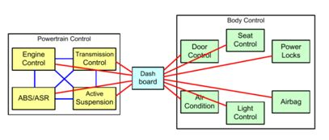

总线通信
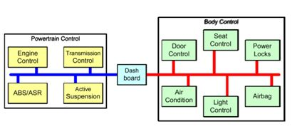

CAN总线是BOSCH开发的，并最终成为国际标准（ISO11519），是国际上应用最广泛的现场总线之一。CAN总线是一种多主控（Multi-Master）的总线系统。传统总线系统如USB或以太网等是在总线控制器的协调下，实现从A节点到B节点大量数据的传输。CAN网络的消息是广播式的，即在同一时刻网络上所有节点侦测的数据是一致的，它是一种基于消息广播模式的串行通信总线。

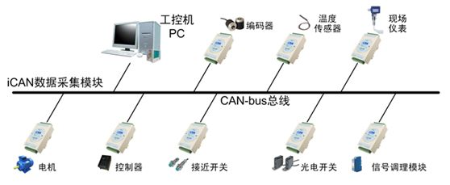

CAN总线的很多优点，使得它得到了广泛的应用，如传输速度最高到1Mbps, 通信距离最远到10km，无损位仲裁机制，多主结构。

### CAN总线标准

CAN总线标准之规定了物理层和数据链路层，至于应用层需要用户自定义。不同的CAN标准仅物理层不同。物理层和数据链路层：ISO11898；应用层：不同的应用领域使用不同的应用层标准。

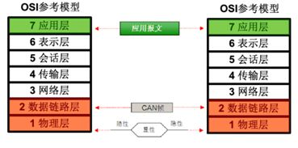

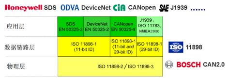

## CAN物理层

### CAN拓扑网络

连接在CAN总线上的设备叫做节点设备（CAN Node），CAN网络的拓扑一般为线型。线束最常用的是双绞线，线上传输为对称的差分电平信号。下图为CAN总线网络示意图，节点主要包括Host、控制器和收发器。Host常集成有CAN控制器，CAN控制器负责处理协议相关功能，以减轻Host的负担。CAN收发器将控制器连接到传输媒介。通常控制器和总线收发器通过光耦或磁耦隔离，这样即使总线上过压损坏收发器，控制器和Host设备也可以得到保护。

在发送数据时，CAN控制器把要发送的二进制编码通过CAN_Tx线发送到CAN收发器，然后由收发器把这个普通的逻辑电平信号转化成差分信号，通过差分线CAN_High和CAN_Low输出到CAN总线网络。接收数据过程，相反。采用差分信号，可以取得更好的电磁兼容效果。因此，CAN总线物理传输媒介只需要两根线。

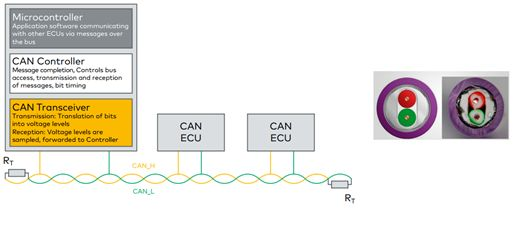

高速CAN总线最高信号传输速率为1Mbps，支持最长距离40m。ISO11898-2要求在高速CAN总线两段安装端接电阻RL（端接电阻一般为120Ω，因为电缆的特性阻抗为120 Ω，为了模拟无限远的传输线。）以消除反射。低速CAN最高速度只有125Kbps，所以ISO11898-3没有端接要求。

因为传输距离越大，信号时延也越大，为了保证消息的正确采样，总线上的信号速率相应也要下降。下图是推荐的信号速率与距离的关系。

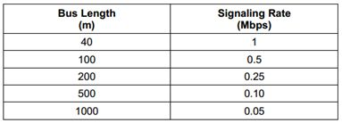

### CAN收发器

CAN总线分高速CAN和低速CAN，收发器也分为高速CAN收发器（1Mbps）和低速CAN收发器（125Kbps）。低速CAN也叫Fault Tolerance CAN，指的是即使总线上一根线失效，总线依然可以通信。如同串口中的MAX3232用作电平转换，CAN收发器的作用则是把逻辑信号转换为差分信号。

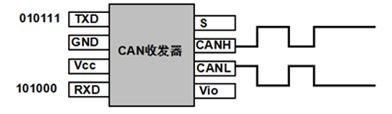

### 差分信号

CAN总线采用差分信号传输，通常情况下只需要两根信号线就可以进行正常的通信。在差分信号中，逻辑0和逻辑1是用两根差分信号线的电压差来表示。当处于逻辑1，CAN_High和CAN_Low的电压差小于0.5V时，称为隐性电平（Recessive）；当处于逻辑0，CAN_High和CAN_Low的电压差大于0.9V，称为显性电平（Dominant）。

高速CAN
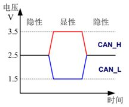

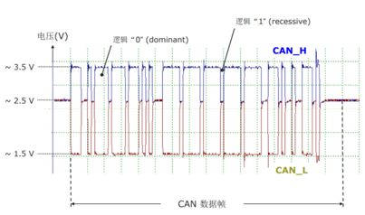

低速容错CAN （Fault Tolerance CAN）
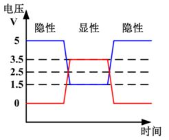

CAN总线遵从“线与”机制：“显性”位可以覆盖“隐性”位；只有所有节点都发送“隐性”位， 总线才处于“隐性” 状态。这种“线与”机制使CAN总线呈现显性优先的特性。

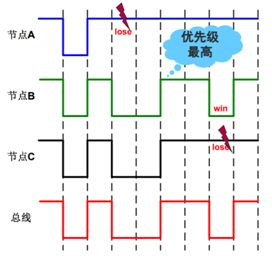

### CAN总线连接器

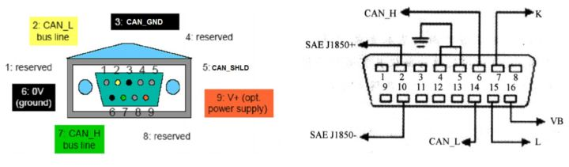

## CAN数据链路层

在SPI(Serial Peripheral Interface, 串行外设接口)通信中，片选、时钟信号、数据输入及数据输出这四个信号都有单独的信号线。而CAN使用的是两条差分信号线，只能表达一个信号。简洁的物理层决定了CAN必然要配上一套更为复杂的协议。如何用一个信号通道实现同样甚至更强大的功能，答案就是对数据或操作命令进行打包。

### 通信机制

#### 多主机（Multi-Master）

安全敏感的应用（如汽车动力）对通信系统的可靠性要求很高。将总线能否正常工作归结到单一节点是非常危险的，比较合理的方案是对总线接入的去中心化，即每个节点都有接入总线的能力。这也是CAN总线采用多主控（Multi-Master）线性拓扑结构的原因。

在CAN总线上，每个节点都有往总线上发送消息的能力，而消息的发送不必遵从任何预先设定的时序，通信是事件驱动的。只有当有新的信息传递时，CAN总线才处于忙碌的状态，这使得节点接入总线速度非常快。CAN总线理论最高数据传输速率为1Mbps，对于异步事件反应迅速，基本对于ms级别的实时应用没有任何问题。

#### 寻址机制

不同于其它类型的总线，CAN总线不设定节点的地址，而是通过消息的标识符（Identifier）来区别消息。这种机制虽然会增加消息的复杂度（增加标识符），但是节点在此情况下可以无需了解其他节点的状况，而相互间独立工作。在总线上增加节点时仅需关注消息类型，而非系统上其他节点的状况。这种以消息标识符寻址的方式，让总线上增加节点变得更加灵活。

#### 总线访问CSMA/CD+AMP

CAN总线通信原理可简单描述为多路载波侦听+基于消息优先级的冲突检测和非破坏性的仲裁机制（CSMA/CD+AMP）。

CSMA（CarrieSense Multiple Access）指的是所有节点必须都等到总线处于空闲状态时才能往总线上发送消息；

CD+AMP（Collision Detection + Arbitration on Message Priority）指的是如果多个节点往总线上发送消息时，具备最高优先级的消息获得总线。

- 多路载波侦听：网络上所有节点以多点接入的方式连接在同一根总线上，且发送数据是广播式的。网络上各个节点在发送数据前都要检测总线上是否有数据传输：若网络上有数据，暂时不发送数据，等待网络空闲时再发；若网络上无数据，立即发送已经准备好的数据。
- 冲突检测：节点在发送数据时，要不停的检测发送的数据，确定是否与其他节点数据发送冲突，如果有冲突，则保证优先级高的报文先发送。
- 非破坏性仲裁机制：通过ID仲裁，ID数值越小，报文优先级越高。

https://zhuanlan.zhihu.com/p/32262127
