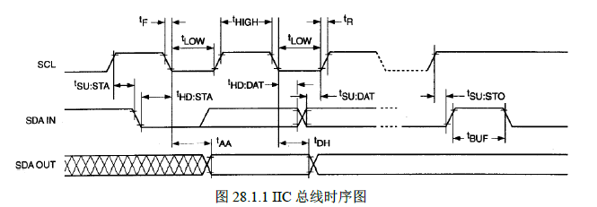
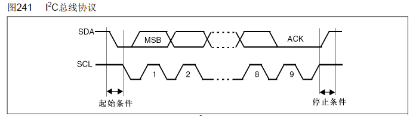
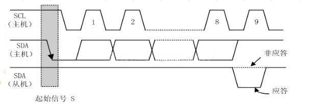

# IIC基本原理

https://blog.csdn.net/qq_38410730/article/details/80312357

## IIC简介

IIC（Inter－Integrated Circuit）总线是一种由PHILIPS公司在80年代开发的两线式串行总线，用于连接微控制器及其外围设备。**它是半双工通信方式。**

* IIC总线最主要的优点是其简单性和有效性。由于接口直接在组件之上，因此IIC总线占用的空间非常小，减少了电路板的空间和芯片管脚的数量，降低了互联成本。总线的长度可高达25英尺，并且能够以10Kbps的最大传输速率支持40个组件。

* IIC总线的另一个优点是，**它支持多主控(multimastering)， 其中任何能够进行发送和接收的设备都可以成为主总线。一个主控能够控制信号的传输和时钟频率。当然，在任何时间点上只能有一个主控。**

**IIC串行总线一般有两根信号线，一根是双向的数据线SDA，另一根是时钟线SCL，其时钟信号是由主控器件产生。所有接到IIC总线设备上的串行数据SDA都接到总线的SDA上，各设备的时钟线SCL接到总线的SCL上。对于并联在一条总线上的每个IC都有唯一的地址。**

一般情况下，数据线SDA和时钟线SCL都是处于上拉电阻状态。因为：在总线空闲状态时，这两根线一般被上面所接的上拉电阻拉高，保持着高电平。

## IIC协议

IIC总线在传输数据的过程中一共有三种类型信号，分别为：**开始信号、结束信号和应答信号。这些信号中，起始信号是必需的，结束信号和应答信号，都可以不要。**同时我们还要介绍其空闲状态、数据的有效性、数据传输。

先来看一下IIC总线的时序图：

这可能会比较复杂，可以先看一份简化了的时序图：

### 空闲状态

**当IIC总线的数据线SDA和时钟线SCL两条信号线同时处于高电平时，规定为总线的空闲状态。**此时各个器件的输出级场效应管均处在截止状态，即释放总线，由两条信号线各自的上拉电阻把电平拉高。 

### 起始信号与停止信号

- **起始信号：当时钟线SCL为高期间，数据线SDA由高到低的跳变；**启动信号是一种电平跳变时序信号，而不是一个电平信号；

- **停止信号：当时钟线SCL为高期间，数据线SDA由低到高的跳变；**停止信号也是一种电平跳变时序信号，而不是一个电平信号。

  

### 应答信号

发送器**每发送一个字节（8个bit），就在时钟脉冲9期间释放数据线，由接收器反馈一个应答信号。** 

- **应答信号为低电平时，规定为有效应答位（ACK，简称应答位），表示接收器已经成功地接收了该字节；**
- **应答信号为高电平时，规定为非应答位（NACK），一般表示接收器接收该字节没有成功。** 

对于反馈有效应答位ACK的要求是：接收器在第9个时钟脉冲之前的低电平期间将数据线SDA拉低，并且确保在该时钟的高电平期间为稳定的低电平。 如果接收器是主控器，则在它收到最后一个字节后，发送一个NACK信号，以通知被控发送器结束数据发送，并释放数据线SDA，以便主控接收器发送一个停止信号P。

### 数据有效性

**IIC总线进行数据传送时，时钟信号为高电平期间，数据线上的数据必须保持稳定；只有在时钟线上的信号为低电平期间，数据线上的高电平或低电平状态才允许变化。** 