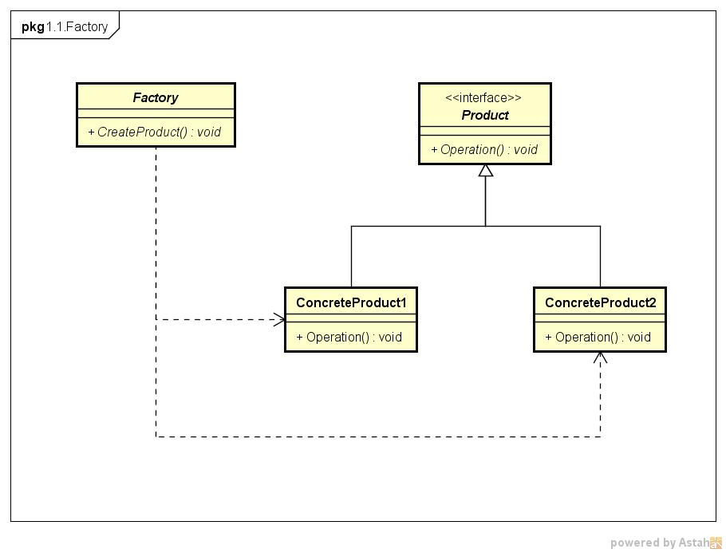
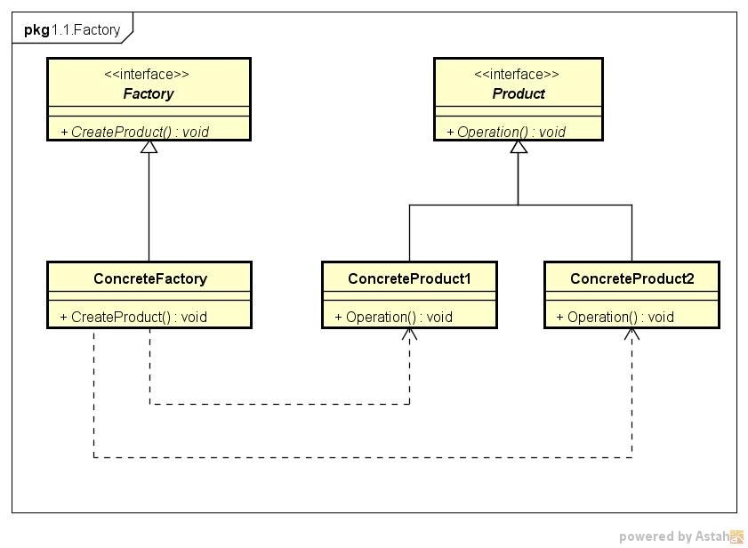

# Factory模式

参考： https://www.jianshu.com/p/e55fbddc071c

工厂模式实现了创建者和调用者的分离

## 简单工厂模式(Simple Factory)

简单工厂模式又叫静态方法模式（因为工厂类定义了一个静态方法）

现实生活中，工厂是负责生产产品的；同样在设计模式中，简单工厂模式我们可以理解为负责生产对象的一个类，称为“工厂类”。

### 使用场景

将“类实例化的操作”与“使用对象的操作”分开，让使用者不用知道具体参数就可以实例化出所需要的“产品”类，从而避免了在客户端代码中显式指定，实现了解耦。

即使用者可直接消费产品而不需要知道其生产的细节.

### 模式组成

|组成(角色)|关系|作用|
|:--|:--|:--|
|抽象产品(Product)|具体产品的父类|描述产品的公共接口|
|具体产品(ConcreteProduct)|抽象产品的子类；工厂类创建的目标类|描述生产的具体产品|
|工厂(Factory)|被外界调用|根据传入不同参数而创建不同具体产品类的实例|

### 类图



### 实例

* 背景：小成有一个塑料生产厂，用来做塑料加工生意
* 目的：最近推出了3个产品，小成希望使用简单工厂模式实现3款产品的生产

*步骤1.* 创建抽象产品类，定义具体产品的公共接口

```cpp
class Product
{
public:
    virtual void show() = 0;
};
```

*步骤2.*  创建具体产品类（继承抽象产品类），定义生产的具体产品

```cpp
//具体产品类A
class  ProductA : public  Product
{
public:
     void Show() {
        std::cout << "生产出了产品A" << std::endl;
    }
};

//具体产品类B
class  ProductB : public  Product
{
public:
     void Show() {
        std::cout << "生产出了产品B" << std::endl;
    }
};

//具体产品类C
class  ProductC : public  Product
{
public:
     void Show() {
        std::cout << "生产出了产品C" << std::endl;
    }
};
```

*步骤3.* 创建工厂类，通过创建静态方法从而根据传入不同参数创建不同具体产品类的实例

```cpp
class  Factory
{
public:
    Product* Manufacture(std::string ProductName)
    {
        //工厂类里用switch语句控制生产哪种商品；
        //使用者只需要调用工厂类的静态方法就可以实现产品类的实例化。
        switch (ProductName){
            case "A":
                return new ProductA();

            case "B":
                return new ProductB();

            case "C":
                return new ProductC();

            default:
                return NULL;

        }
    }
}；
```

*步骤4.* 外界通过调用工厂类的静态方法，传入不同参数从而创建不同具体产品类的实例

```cpp
int main()
{
    Factory* mFactory = new Factory();

    //客户要产品A
    //调用工厂类的方法 & 传入不同参数从而创建产品实例
    Product *productA = mFactory->Manufacture("A")
    if (NULL != productA)
    {
        productA->Show();
        delete productA;
    }

    //客户要产品B
    Product *productB = mFactory->Manufacture("B")
    if (NULL != productB)
    {
        productB->Show();
        delete productB;
    }

    //客户要产品C
    Product *productC = mFactory->Manufacture("B")
    if (NULL != productC)
    {
        productC->Show();
        delete productC;
    }


    return 0;
}
```

### 问题

* 工厂类集中了所有实例（Product）的创建逻辑，一旦这个工厂不能正常工作，整个系统都会受到影响；
* 违背“开放 - 关闭原则”，一旦添加新产品就不得不修改工厂类的逻辑，这样就会造成工厂逻辑过于复杂。
* 简单工厂模式由于使用了静态工厂方法，静态方法不能被继承和重写，会造成工厂角色无法形成基于继承的等级结构。

## 工厂模式(Factory)

定义创建对象的接口，并且让子类决定实例化哪一个类，使一个类的实例化延迟到其子类。

